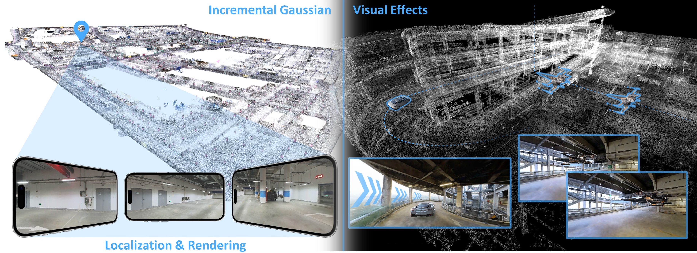
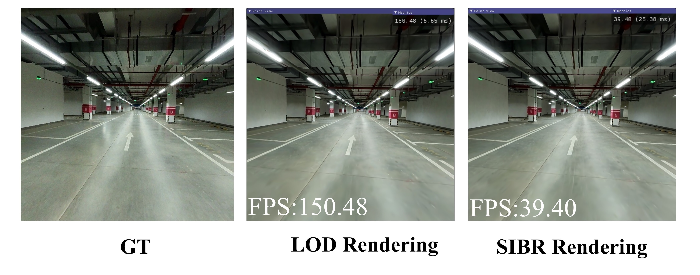
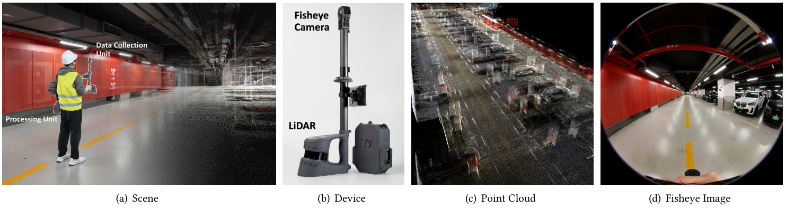
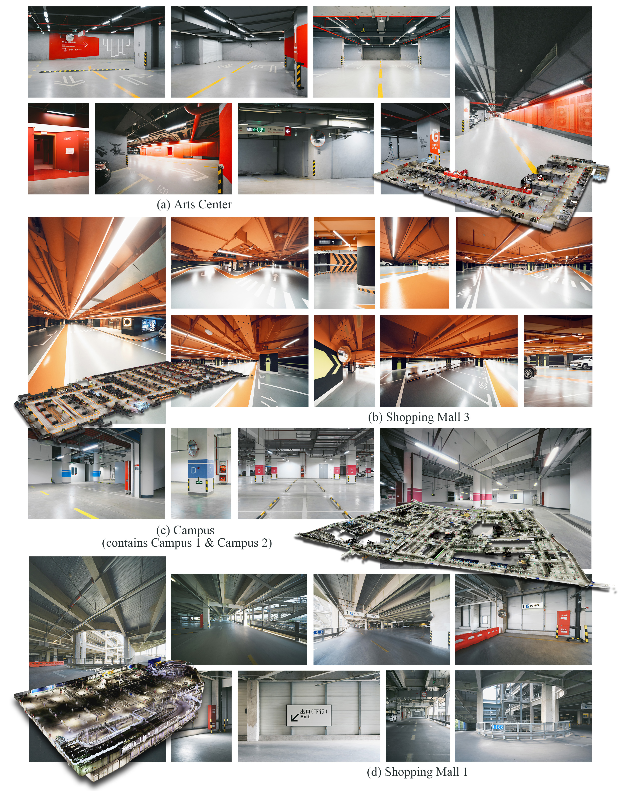

# LetsGo: Large-Scale Garage Modeling and Rendering via LiDAR-Assisted Gaussian Primitives
<!-- Jiadi Cui*, Junming Cao*, Fuqiang Zhao*, Zhipeng He, Yifan Chen, Yuhui Zhong, Lan Xu, Yujiao Shi, Yingliang Zhang†, Jingyi Yu† -->

[Project page](https://zhaofuq.github.io/LetsGo/) | [Paper](https://arxiv.org/pdf/2404.09748) | [Video](https://www.youtube.com/watch?v=fs42UBKvGRw) | [LOD Viewer (SIBR)](https://zhaofuq.github.io/LetsGo/) | [Web Viewer](https://zhaofuq.github.io/LetsGo/)| [GarageWorld Dataset](https://zhaofuq.github.io/LetsGo/) <br>



This repository contains the official implementation associated with the paper "LetsGo: Large-Scale Garage Modeling and Rendering via LiDAR-Assisted Gaussian Primitives"

## Abstract

Large garages are ubiquitous yet intricate scenes in our daily lives. They pose challenges characterized by monotonous colors, repetitive patterns, reflective surfaces, and transparent vehicle glass. 
Conventional Structure from Motion (SfM) methods for camera pose estimation and 3D reconstruction fail in these environments due to poor correspondence construction. To address these challenges, this paper introduces LetsGo, a LiDAR-assisted Gaussian splatting framework for large-scale garage modeling and rendering.
We develop a handheld scanner, Polar, equipped with IMU, LiDAR, and a fisheye camera, to facilitate accurate LiDAR and image data scanning. 
With this Polar device, we present a GarageWorld dataset consisting of eight expansive garage scenes with diverse geometric structures and will release the dataset to the community for further research.
We demonstrate that the collected LiDAR point cloud by the Polar device enhances a suite of 3D Gaussian splatting algorithms for garage scene modeling and rendering. 
We also introduce a novel depth regularizer that effectively eliminates floating artifacts in rendered images.
Furthermore, we propose a multi-resolution 3D Gaussian representation designed for Level-of-Detail rendering. We use tailored scaling factors for individual levels and a random-resolution-level training scheme to optimize the Gaussians across different levels. This 3D Gaussian representation enables efficient rendering of large-scale garage scenes on lightweight devices via a web-based renderer. 
Experimental results on our dataset, along with ScanNet++ and KITTI-360, demonstrate the superiority of our method in rendering quality and resource efficiency.

## Installation
```bash
# clone repo
git clone https://github.com/zhaofuq/LOD-3DGS.git --recursive

# create a new python environment
conda env create --file environment.yml
conda activate lod-3dgs

# build PotreeConverter for Multi-Resolution Pointcloud
cd PotreeConverter 
cmake . -B build
cmake --build build --config Release
```

## Training
To train a scene in our GarageWorld dataset, simply use
```bash
python train.py -s <path to GarageWorld scene with COLMAP format> \
    --use_lod \
    --sh_degree 2 \
    --depths depths \ # use for depth loss if contains depths folder.
    --densification_interval 10000 \
    --iterations 300000 \
    --opacity_reset_interval 300000 \ 
    --densify_until_iter 200000 \
    --data_device cpu \
    -r 1
```

<details>
<summary><span style="font-weight: bold;">Command Line Arguments for train.py</span></summary>

  #### --source_path / -s
  Path to the source directory containing a COLMAP or Synthetic NeRF data set.
  #### --model_path / -m 
  Path where the trained model should be stored (```output/<random>``` by default).
  #### --images / -i
  Alternative subdirectory for COLMAP images (```images``` by default).
  #### --depth / -d
  Alternative subdirectory for depth images (```depths``` by default).
  #### --eval
  Add this flag to use a MipNeRF360-style training/test split for evaluation.
  #### --resolution / -r
  Specifies resolution of the loaded images before training. If provided ```1, 2, 4``` or ```8```, uses original, 1/2, 1/4 or 1/8 resolution, respectively. For all other values, rescales the width to the given number while maintaining image aspect. **If not set and input image width exceeds 1.6K pixels, inputs are automatically rescaled to this target.**
  #### --data_device
  Specifies where to put the source image data, ```cuda``` by default, recommended to use ```cpu``` if training on large/high-resolution dataset, will reduce VRAM consumption, but slightly slow down training. Thanks to [HrsPythonix](https://github.com/HrsPythonix).
  #### --white_background / -w
  Add this flag to use white background instead of black (default), e.g., for evaluation of NeRF Synthetic dataset.
  #### --sh_degree
  Order of spherical harmonics to be used (no larger than 3). ```3``` by default.
  #### --convert_SHs_python
  Flag to make pipeline compute forward and backward of SHs with PyTorch instead of ours.
  #### --convert_cov3D_python
  Flag to make pipeline compute forward and backward of the 3D covariance with PyTorch instead of ours.
  #### --debug
  Enables debug mode if you experience erros. If the rasterizer fails, a ```dump``` file is created that you may forward to us in an issue so we can take a look.
  #### --debug_from
  Debugging is **slow**. You may specify an iteration (starting from 0) after which the above debugging becomes active.
  #### --iterations
  Number of total iterations to train for, ```30_000``` by default.
  #### --ip
  IP to start GUI server on, ```127.0.0.1``` by default.
  #### --port 
  Port to use for GUI server, ```6009``` by default.
  #### --test_iterations
  Space-separated iterations at which the training script computes L1 and PSNR over test set, ```7000 30000``` by default.
  #### --save_iterations
  Space-separated iterations at which the training script saves the Gaussian model, ```7000 30000 <iterations>``` by default.
  #### --checkpoint_iterations
  Space-separated iterations at which to store a checkpoint for continuing later, saved in the model directory.
  #### --start_checkpoint
  Path to a saved checkpoint to continue training from.
  #### --quiet 
  Flag to omit any text written to standard out pipe. 
  #### --feature_lr
  Spherical harmonics features learning rate, ```0.0025``` by default.
  #### --opacity_lr
  Opacity learning rate, ```0.05``` by default.
  #### --scaling_lr
  Scaling learning rate, ```0.005``` by default.
  #### --rotation_lr
  Rotation learning rate, ```0.001``` by default.
  #### --position_lr_max_steps
  Number of steps (from 0) where position learning rate goes from ```initial``` to ```final```. ```30_000``` by default.
  #### --position_lr_init
  Initial 3D position learning rate, ```0.00016``` by default.
  #### --position_lr_final
  Final 3D position learning rate, ```0.0000016``` by default.
  #### --position_lr_delay_mult
  Position learning rate multiplier (cf. Plenoxels), ```0.01``` by default. 
  #### --densify_from_iter
  Iteration where densification starts, ```500``` by default. 
  #### --densify_until_iter
  Iteration where densification stops, ```15_000``` by default.
  #### --densify_grad_threshold
  Limit that decides if points should be densified based on 2D position gradient, ```0.0002``` by default.
  #### --densification_interval
  How frequently to densify, ```100``` (every 100 iterations) by default.
  #### --opacity_reset_interval
  How frequently to reset opacity, ```3_000``` by default. 
  #### --lambda_dssim
  Influence of SSIM on total loss from 0 to 1, ```0.2``` by default. 
  #### --percent_dense
  Percentage of scene extent (0--1) a point must exceed to be forcibly densified, ```0.01``` by default.

</details>
<br>

## Rendering
To render a trained model, simply use
```bash
python render.py -m <path to model path> 
```
<details>
<summary><span style="font-weight: bold;">Command Line Arguments for render.py</span></summary>

  #### --model_path / -m 
  Path to the trained model directory you want to create renderings for.
  #### --skip_train
  Flag to skip rendering the training set.
  #### --skip_test
  Flag to skip rendering the test set.
  #### --quiet 
  Flag to omit any text written to standard out pipe. 

  **The below parameters will be read automatically from the model path, based on what was used for training. However, you may override them by providing them explicitly on the command line.** 

  #### --source_path / -s
  Path to the source directory containing a COLMAP or Synthetic NeRF data set.
  #### --images / -i
  Alternative subdirectory for COLMAP images (```images``` by default).
  #### --eval
  Add this flag to use a MipNeRF360-style training/test split for evaluation.
  #### --resolution / -r
  Changes the resolution of the loaded images before training. If provided ```1, 2, 4``` or ```8```, uses original, 1/2, 1/4 or 1/8 resolution, respectively. For all other values, rescales the width to the given number while maintaining image aspect. ```1``` by default.
  #### --white_background / -w
  Add this flag to use white background instead of black (default), e.g., for evaluation of NeRF Synthetic dataset.
  #### --convert_SHs_python
  Flag to make pipeline render with computed SHs from PyTorch instead of ours.
  #### --convert_cov3D_python
  Flag to make pipeline render with computed 3D covariance from PyTorch instead of ours.

</details>

## Interactive LOD Viewers
Our viewing solutions are based on the SIBR framework, developed by the GRAPHDECO group for several novel-view synthesis projects. We intergrate LOD rendering technique into SIBR framework to make faster rendering effects.



### Hardware Requirements

- CUDA-ready GPU with Compute Capability 7.0+
- 24 GB VRAM (to train to paper evaluation quality)
- Please see FAQ for smaller VRAM configurations

### Software Requirements
- Conda (recommended for easy setup)
- C++ Compiler for PyTorch extensions (we used Visual Studio 2019 for Windows)
- CUDA SDK 11 for PyTorch extensions, install *after* Visual Studio (we used 11.8, **known issues with 11.6**)
- C++ Compiler and CUDA SDK must be compatible

### Installation from Source
If you cloned with submodules (e.g., using ```--recursive```), the source code for the viewers is found in ```SIBR_viewers```. The network viewer runs within the SIBR framework for Image-based Rendering applications.

#### Windows
CMake should take care of your dependencies.
```shell
cd SIBR_viewers
cmake . -B build
cmake --build build --target install --config RelWithDebInfo
```
You may specify a different configuration, e.g. ```Debug``` if you need more control during development.

#### Ubuntu 22.04
You will need to install a few dependencies before running the project setup.
```shell
# Dependencies
sudo apt install -y libglew-dev libassimp-dev libboost-all-dev libgtk-3-dev libopencv-dev libglfw3-dev libavdevice-dev libavcodec-dev libeigen3-dev libxxf86vm-dev libembree-dev
# Project setup
cd SIBR_viewers
cmake -Bbuild . -DCMAKE_BUILD_TYPE=Release # add -G Ninja to build faster
cmake --build build -j24 --target install
``` 

#### Ubuntu 20.04
Backwards compatibility with Focal Fossa is not fully tested, but building SIBR with CMake should still work after invoking
```shell
git checkout fossa_compatibility
```

## GarageWorld Dataset
### Self-designed Polar Scanning System
Using our polar divide, we build GarageWorld, the first large-scale garage dataset.



### GarageWorld Dataset


<!--  <section class="section" id="BibTeX">
  <div class="container is-max-desktop content">
    <h2 class="title">BibTeX</h2>
    <pre><code>@article{cui2024letsgo,
        title={LetsGo: Large-Scale Garage Modeling and Rendering via LiDAR-Assisted Gaussian Primitives},
        author={Jiadi Cui, Junming Cao, Fuqiang Zhao, Zhipeng He, Yifan Chen, Yuhui Zhong, Lan Xu, Yujiao Shi, Yingliang Zhang, Jingyi Yu},
        journal={arXiv preprint arXiv:2404.09748},
        year={2024}
    }
</code></pre>
  </div>
</section> -->
